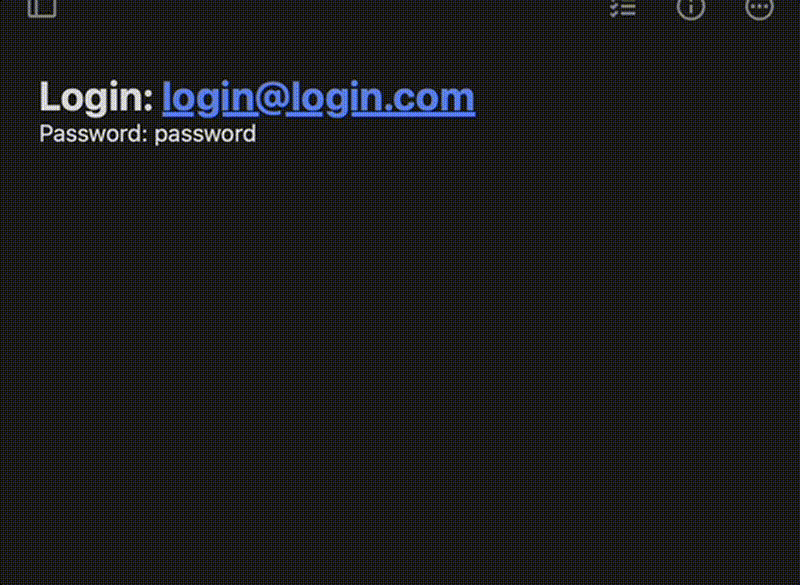

<p align="center">
  
</p>

<h1 align="center">Power Clipboard</h1>

<p align="center">
  <strong>The best clipboard manager ever!</strong><br>
  <em>Stack everything you copy. Navigate your clipboard history with a keystroke.</em>
</p>

<p align="center">
  A native clipboard manager for macOS, Linux, and Windows built with <a href="https://v2.tauri.app/">Tauri v2</a>.
</p>

---

<p align="center">
  
</p>

## Features

- **Clipboard stacking** — Every `Cmd+C` (or `Ctrl+C`) pushes to a unique-value stack. No duplicates.
- **Keyboard navigation** — `Cmd+Shift+Down/Up` to cycle through your clipboard history. The selected item is automatically copied.
- **Overlay** — A minimal floating list appears top-right when navigating. Auto-hides after 2 seconds of inactivity.
- **Privacy** — Only the first 2 characters of each item are shown (+ ellipsis).
- **System tray** — Lives in your menu bar. Right-click for Settings or Quit.
- **Dock-aware** — No dock icon by default. Appears only when Settings are open (macOS).
- **Configurable** — Stack limit adjustable from 1 to 50 (default: 5).

## Install

### From source

```bash
# Prerequisites: Rust, Node.js
npm install
cargo tauri build --bundles app
```

The `.app` bundle will be at `src-tauri/target/release/bundle/macos/Power Clipboard.app`.

Copy it to `/Applications`:

```bash
cp -r "src-tauri/target/release/bundle/macos/Power Clipboard.app" /Applications/
```

### Development

```bash
npm install
cargo tauri dev
```

## Keyboard Shortcuts

| Shortcut | Action |
|---|---|
| `Cmd+Shift+Down` | Select previous clipboard item |
| `Cmd+Shift+Up` | Select next clipboard item |

> On Windows/Linux, replace `Cmd` with `Ctrl`.

## Architecture

```
src-tauri/src/
├── main.rs               # Entry point, plugins, shortcuts
├── clipboard_stack.rs    # Unique-value bounded stack with navigation
├── clipboard_monitor.rs  # Polls clipboard every 500ms
├── commands.rs           # Tauri commands (get/set settings)
└── tray.rs               # System tray icon + menu

ui/
├── overlay/              # Floating clipboard list (transparent window)
└── settings/             # Settings window
```

## Tech Stack

- **Tauri v2** — Native app shell
- **Rust** — Backend (clipboard monitoring, stack management, global shortcuts)
- **HTML/CSS/JS** — Frontend (no framework)

## License

MIT
